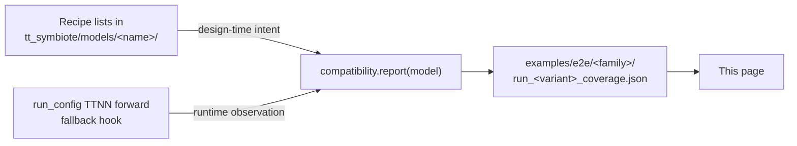

# CPU vs. device coverage per demo

For every verified or structurally-supported `examples/e2e/` script,
this page documents *where every model submodule runs* — on the
Tenstorrent device (N150 / N300 / T3K) or on the host CPU. The data is
sourced from the per-script `*_coverage.json` artefacts that each demo
writes next to itself; this document just aggregates them into a
human-readable table.

## Pipeline

Each recipe in [`tt_symbiote.models.*`](../src/tt_symbiote/models/)
declares three class-name lists:

- `tt_implemented` — HF classes the recipe ships a TTNN wrapper for
  (in `build_module_dict`). These run on Tenstorrent silicon.
- `cpu_fallback` — HF classes exercised by the demo that stay as
  PyTorch. These run on the host CPU.
- `out_of_scope` — HF classes that exist in the upstream modeling
  file but aren't touched by the documented demo path (audio towers
  on image-only demos, output dataclasses, alternative heads).

Where the recipe also enables it (Phase 7+), a runtime hook in
[`tt_symbiote.core.run_config`](../src/tt_symbiote/core/run_config.py)
records every `TTNNModule.forward` exception that fell back to PyTorch.
That ledger is surfaced under `runtime_observed.unexpected` — *any
non-empty value there is a regression*: it means a TTNN wrapper failed
mid-run and the recipe didn't declare it as a known fallback.

## How to regenerate this page

Re-run the demo whose row you want refreshed. The JSON next to the
script updates atomically; copy the relevant counts and class lists
into the table below. The JSON files are checked in so the table never
drifts from reality.

## Coverage by model

### Causal LM

#### Ling-mini-2.0 — T3K (1×8), full TTNN

Source: [`examples/e2e/run_ling_mini_2_0.py`](../examples/e2e/run_ling_mini_2_0.py)
+ [`examples/e2e/run_ling_mini_2_0_coverage.json`](../examples/e2e/run_ling_mini_2_0_coverage.json)

The Ling recipe predates the Phase 7 design-time list convention, so
its `tt_implemented` / `cpu_fallback` / `out_of_scope` lists are not
yet populated; the runtime ledger (when re-run on T3K) is the
authoritative source. From the Phase 5 acceptance: every text decoder
submodule (RMSNorm, attention, MoE experts + router, decoder layer,
top-level model) runs on **T3K device**; tokenizer + the `generate`
scaffolding run on CPU.

Follow-up: backfill the recipe's three design-time lists, mirroring
the Gemma-4 / Qwen3-VL pattern.

### Image classification

#### ResNet-50 — N150 (1×1), full TTNN

Source: [`examples/e2e/resnet/run_resnet50.py`](../examples/e2e/resnet/run_resnet50.py)
+ [`examples/e2e/resnet/run_resnet50_coverage.json`](../examples/e2e/resnet/run_resnet50_coverage.json)

Same caveat as Ling — the ResNet recipe predates the design-time list
convention; counts in the JSON are zero. Runtime: zero unexpected
fallbacks on the verified run.

From the recipe source ([`modeling_resnet.py`](../src/tt_symbiote/models/resnet/modeling_resnet.py)):

| Module | Where it runs | Notes |
|---|---|---|
| `TTNNResNetEmbeddings` (stem) | **N150** | 7×7 stride-2 conv, NCHW → NHWC permute |
| `TTNNResNetConvLayer` | **N150** | fused conv + BN + activation |
| `TTNNResNetShortCut` | **N150** | identity / 1×1 projection |
| `TTNNResNetBasicLayer` (resnet-18/34) | **N150** | two-conv block |
| `TTNNResNetBottleNeckLayer` (resnet-50/101/152) | **N150** | three-conv block |
| `ResNetEncoder` | **N150** (walks children) | unchanged HF wrapper |
| `nn.AdaptiveAvgPool2d` + `nn.Linear` (classifier) | **CPU** | post NHWC → NCHW boundary |

The four sibling variants (`resnet-18`, `-34`, `-101`, `-152`) share
the same recipe; their coverage JSONs are stubs until each runs on
hardware.

### Image-text-to-text (VLM)

All four Gemma-4 and four dense Qwen3-VL variants are **CPU-first**
ports — every submodule listed runs on the host CPU; the TTNN mesh is
opened only to satisfy the `set_device` contract and to give
`post_register` a handle for the per-variant `_tt_runtime_config`.
Future commits will move submodules from `cpu_fallback` to
`tt_implemented` and re-run the demos to update the JSONs.

#### Gemma-4 E2B-it — N150 (1×1), CPU-first (✅ verified)

Source: [`examples/e2e/gemma4/run_gemma4_e2b.py`](../examples/e2e/gemma4/run_gemma4_e2b.py)
+ [`examples/e2e/gemma4/run_gemma4_e2b_coverage.json`](../examples/e2e/gemma4/run_gemma4_e2b_coverage.json)

Counts (design + runtime): **0 TT / 21 CPU / 14 OOS**. `runtime_observed.unexpected == []`.

| Stage | Component class | Where | Hardware |
|---|---|---|---|
| TTNN runtime | `ttnn.set_fabric_config` + `open_mesh_device` | N150 (mgmt only) | device init |
| Loader | `AutoProcessor.from_pretrained` | CPU | — |
| Loader | `AutoModelForImageTextToText.from_pretrained` | CPU (host RAM) | — |
| Walker | `tt_symbiote.set_device` | CPU + N150 handle | no compute |
| Tokenisation | `processor.apply_chat_template` | CPU | — |
| Forward (shared) | `Gemma4ClippableLinear`, `Gemma4RMSNorm` | CPU | — |
| Forward (vision) | `Gemma4VisionPatchEmbedder`, `Gemma4VisionRotaryEmbedding`, `Gemma4VisionAttention`, `Gemma4VisionMLP`, `Gemma4VisionEncoderLayer`, `Gemma4VisionEncoder`, `Gemma4VisionPooler`, `Gemma4VisionModel` | CPU | — |
| Forward (projection) | `Gemma4MultimodalEmbedder` | CPU | — |
| Forward (text) | `Gemma4TextScaledWordEmbedding`, `Gemma4TextRotaryEmbedding`, `Gemma4TextAttention`, `Gemma4TextMLP`, `Gemma4TextExperts`*, `Gemma4TextRouter`*, `Gemma4TextDecoderLayer`, `Gemma4TextModel` | CPU | * MoE pair unused on E2B |
| Forward (top-level) | `Gemma4Model`, `Gemma4ForConditionalGeneration` | CPU | — |
| De-tokenisation | `processor.batch_decode` | CPU | — |
| Out of scope | 9× `Gemma4Audio*`, `Gemma4ForCausalLM`, 4× output dataclass | — | — |

#### Gemma-4 E4B-it — N150 (1×1), CPU-first (⏳ structurally supported)

Source: [`run_gemma4_e4b.py`](../examples/e2e/gemma4/run_gemma4_e4b.py)
+ [`coverage stub`](../examples/e2e/gemma4/run_gemma4_e4b_coverage.json).
Same class layout as E2B (same recipe). Counts: 0 TT / 21 CPU / 14 OOS
(design-time).

#### Gemma-4 31B-it — T3K (1×8), CPU-first (⏳ structurally supported)

Source: [`run_gemma4_31b.py`](../examples/e2e/gemma4/run_gemma4_31b.py)
+ [`coverage stub`](../examples/e2e/gemma4/run_gemma4_31b_coverage.json).
Same class layout as E2B; mesh shape `(1, 8)`.

#### Gemma-4 26B-A4B-it — T3K (1×8), MoE, CPU-first (⏳ structurally supported)

Source: [`run_gemma4_26b_a4b.py`](../examples/e2e/gemma4/run_gemma4_26b_a4b.py)
+ [`coverage stub`](../examples/e2e/gemma4/run_gemma4_26b_a4b_coverage.json).
Same class layout; the `Gemma4TextExperts` / `Gemma4TextRouter` MoE
pair *is* exercised here (unlike on E2B).

#### Qwen3-VL-2B-Instruct — N150 (1×1), CPU-first (✅ verified)

Source: [`examples/e2e/qwen3_vl/run_qwen3_vl_2b.py`](../examples/e2e/qwen3_vl/run_qwen3_vl_2b.py)
+ [`examples/e2e/qwen3_vl/run_qwen3_vl_2b_coverage.json`](../examples/e2e/qwen3_vl/run_qwen3_vl_2b_coverage.json)

Counts: **0 TT / 16 CPU / 3 OOS**. `runtime_observed.unexpected == []`.

| Stage | Component class | Where | Hardware |
|---|---|---|---|
| TTNN runtime | `set_fabric_config(DISABLED)` + `open_mesh_device((1,1))` | N150 (mgmt) | init/alloc |
| Loader | `AutoProcessor.from_pretrained` (→ `Qwen3VLProcessor`) | CPU | — |
| Loader | `AutoModelForImageTextToText.from_pretrained` | CPU | — |
| Walker | `tt_symbiote.set_device` | CPU + N150 handle | no compute |
| Tokenisation | `processor.apply_chat_template` | CPU | — |
| Forward (vision) | `Qwen3VLVisionPatchEmbed`, `Qwen3VLVisionRotaryEmbedding`, `Qwen3VLVisionPatchMerger`, `Qwen3VLVisionAttention`, `Qwen3VLVisionMLP`, `Qwen3VLVisionBlock`, `Qwen3VLVisionModel` | CPU | — |
| Forward (text) | `Qwen3VLTextRotaryEmbedding`, `Qwen3VLTextRMSNorm`, `Qwen3VLTextAttention`, `Qwen3VLTextMLP`, `Qwen3VLTextDecoderLayer`, `Qwen3VLTextModel` | CPU | — |
| Forward (top-level) | `Qwen3VLPreTrainedModel`, `Qwen3VLModel`, `Qwen3VLForConditionalGeneration` | CPU | — |
| De-tokenisation | `processor.batch_decode` | CPU | — |
| Out of scope | `BaseModelOutputWithDeepstackFeatures`, `Qwen3VLModelOutputWithPast`, `Qwen3VLCausalLMOutputWithPast` | — | — |

Qwen3-VL has no audio tower, which is why the OOS count is 3 (just
the output dataclasses) vs. Gemma-4's 14.

#### Qwen3-VL-4B / 8B / 32B Instruct — CPU-first (⏳ structurally supported)

Same class layout as 2B (same recipe). Per-variant sources:
[`run_qwen3_vl_4b.py`](../examples/e2e/qwen3_vl/run_qwen3_vl_4b.py)
([stub](../examples/e2e/qwen3_vl/run_qwen3_vl_4b_coverage.json)),
[`run_qwen3_vl_8b.py`](../examples/e2e/qwen3_vl/run_qwen3_vl_8b.py)
([stub](../examples/e2e/qwen3_vl/run_qwen3_vl_8b_coverage.json)),
[`run_qwen3_vl_32b.py`](../examples/e2e/qwen3_vl/run_qwen3_vl_32b.py)
([stub](../examples/e2e/qwen3_vl/run_qwen3_vl_32b_coverage.json)).

## Summary table

Aggregating the JSON files into a single overview:

| Demo | Hardware | Status | TT classes | CPU classes | OOS classes | Runtime unexpected |
|---|---|---|---|---|---|---|
| `run_ling_mini_2_0.py` | T3K (1×8) | ✅ verified (Phase 5) | not yet declared | not yet declared | not yet declared | clean at Phase 5 acceptance |
| `resnet/run_resnet18.py` | N150 (1×1) | ⏳ stub | 0 | 0 | 0 | n/a |
| `resnet/run_resnet34.py` | N150 (1×1) | ⏳ stub | 0 | 0 | 0 | n/a |
| `resnet/run_resnet50.py` | N150 (1×1) | ✅ verified (re-run in reorg) | 0 (lists not declared) | 0 (lists not declared) | 0 (lists not declared) | 0 |
| `resnet/run_resnet101.py` | N150 (1×1) | ⏳ stub | 0 | 0 | 0 | n/a |
| `resnet/run_resnet152.py` | N150 (1×1) | ⏳ stub | 0 | 0 | 0 | n/a |
| `gemma4/run_gemma4_e2b.py` | N150 (1×1) | ✅ verified (re-run in reorg) | 0 | 21 | 14 | 0 |
| `gemma4/run_gemma4_e4b.py` | N150 (1×1) | ⏳ stub | 0 | 21 | 14 | n/a |
| `gemma4/run_gemma4_31b.py` | T3K (1×8) | ⏳ stub | 0 | 21 | 14 | n/a |
| `gemma4/run_gemma4_26b_a4b.py` | T3K (1×8) | ⏳ stub | 0 | 21 | 14 | n/a |
| `qwen3_vl/run_qwen3_vl_2b.py` | N150 (1×1) | ✅ verified (re-run in reorg) | 0 | 16 | 3 | 0 |
| `qwen3_vl/run_qwen3_vl_4b.py` | N150 (1×1) | ⏳ stub | 0 | 16 | 3 | n/a |
| `qwen3_vl/run_qwen3_vl_8b.py` | N150 (1×1) | ⏳ stub | 0 | 16 | 3 | n/a |
| `qwen3_vl/run_qwen3_vl_32b.py` | T3K (1×8) | ⏳ stub | 0 | 16 | 3 | n/a |

**Net Tenstorrent coverage today:** ResNet-50 (full TTNN on N150) and
Ling-mini-2.0 (full TTNN on T3K) are the only models with active
on-device execution. Every other entry runs on CPU; the device handle
is opened so the recipe's `_tt_runtime_config` is wired up for the
next TTNN-wrapper commit.

## Open follow-ups

- Backfill `tt_implemented` / `cpu_fallback` / `out_of_scope` lists in
  the **Ling** and **ResNet** recipes so the JSON artefacts have
  populated design-time sections (currently empty for both because
  those recipes predate the Phase 7 list convention).
- Land the first TTNN wrappers for Gemma-4 / Qwen3-VL — the obvious
  starting points are the small shared utilities (`*RMSNorm`,
  `*ClippableLinear`) which already have integration analogues in
  `tt_symbiote.integrations.ttnn_*`.
- CI gate that fails if any committed `*_coverage.json` has
  `runtime_observed.unexpected != []`. Trivial follow-up; the file
  format is already JSON-friendly.
