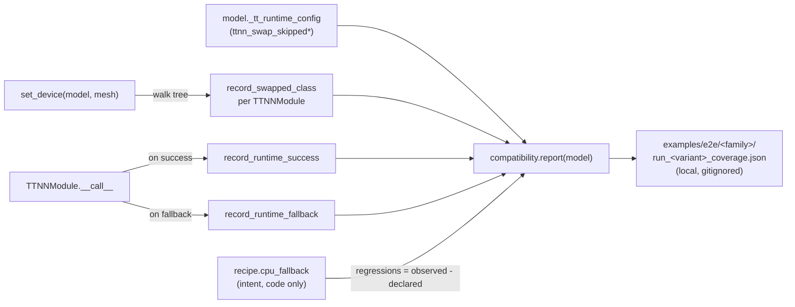

# CPU vs. device coverage per demo

For every verified or structurally-supported `examples/e2e/` script,
this page documents *where every model submodule runs* — on the
Tenstorrent device (N150 / N300 / T3K) or on the host CPU. The class
breakdown below is sourced from the recipe code in
[`tt_symbiote.models.*`](../src/tt_symbiote/models/); a separate
per-demo `*_coverage.json` is *generated locally* every time you run
an `examples/e2e/` script and captures what actually happened on that
run.

> **Phase 8.5 — `*_coverage.json` is a runtime-only artefact.**
> The recipe still ships four design-time lists (`tt_implemented` /
> `cpu_fallback` / `host_glue` / `out_of_scope`), but the JSON output
> no longer echoes them: it serializes *only* what was observed. The
> JSON files are gitignored — operators regenerate them by running
> the demo, then read them locally. This page is the long-form
> textual summary; the JSON is the live diff.

## Pipeline



Each recipe in [`tt_symbiote.models.*`](../src/tt_symbiote/models/)
declares four class-name lists (Phase 8 added `host_glue` alongside
the original three):

- `tt_implemented` — HF classes the recipe ships a TTNN wrapper for
  (in `build_module_dict`). These run on Tenstorrent silicon when the
  variant is not budget-gated.
- `cpu_fallback` — HF classes exercised by the demo that stay as
  PyTorch *for now* (no TTNN equivalent yet). These run on the host
  CPU and are the actionable backlog.
- `host_glue` — HF classes that are intentionally host-only by policy
  (orchestration, mask building, scatter fusion, output dataclasses,
  index walks). These have no FLOPs to accelerate — flagging them
  separately from `cpu_fallback` keeps the backlog focused on
  compute, not glue.
- `out_of_scope` — HF classes that exist in the upstream modeling
  file but aren't touched by the documented demo path (audio towers
  on image-only demos, alternative heads).

These lists drive the budget/MoE gate in `Gemma4Recipe`, the
port-hf-model-to-tt-symbiote skill, and the textual tables on this
page. They are *not* serialized into the JSON.

The JSON instead carries three runtime ledgers + a derived regression
set:

- `modules_swapped` — populated by a post-`set_device` walk: every
  `TTNNModule` still present in the model tree (i.e. the chip-arch
  gate didn't swap it back out) gets recorded as
  `{module_name: hf_class_name}`. Aggregated by class for the at-a-
  glance "how many things ran on device" count.
- `runtime_observed.successes_by_class` — every successful TTNN
  `forward` increments a counter keyed by HF class. Aggregated calls,
  not modules, so the number reflects "this op ran on device X
  times" not "X distinct modules used this class".
- `runtime_observed.fallbacks_by_class` / `.fallbacks_by_module` —
  populated by the existing fallback hook in `run_config`
  (`TTNNModule.forward` raised, `_fallback_torch_layer` carried the
  load). Set semantics (one entry per module).
- `regressions` — the derived field: classes observed in the fallback
  ledger that the recipe does *not* declare under `cpu_fallback`.
  Empty list = clean run; non-empty = a TTNN wrapper failed mid-run
  on a class the recipe expected to succeed.

## How to regenerate the JSON

Re-run the demo whose row you want refreshed:

```bash
python examples/e2e/gemma4/run_gemma4_e2b.py
# → writes examples/e2e/gemma4/run_gemma4_e2b_coverage.json (gitignored)
```

The JSON is overwritten atomically each run; read it locally to see
what shipped vs. what fell back on your machine. To refresh the
textual tables on this page, run the relevant demo, then transcribe
the counts and class lists below.

## Coverage by model

### Causal LM

#### Ling-mini-2.0 — T3K (1×8), full TTNN

Source: [`examples/e2e/run_ling_mini_2_0.py`](../examples/e2e/run_ling_mini_2_0.py).
Re-run the demo to regenerate `run_ling_mini_2_0_coverage.json` next
to the script.

Counts (recipe): **8 TT / 0 CPU / 2 host_glue / 5 OOS**.
`regressions == []` — Ling-mini-2.0 is a *full* TTNN port: every
compute-bearing HF class is wrapped by the recipe, and the runtime
fallback ledger is empty because no `TTNNModule.forward` ever fell
back to its `_fallback_torch_layer`.

| Stage | Component class | Where | Hardware |
|---|---|---|---|
| TTNN runtime | `ttnn.set_fabric_config(FABRIC_1D_RING)` + `open_mesh_device((1,8))` | T3K (mgmt) | init/alloc |
| Loader | `AutoTokenizer.from_pretrained` (`trust_remote_code=True`) | CPU | — |
| Loader | `AutoModelForCausalLM.from_pretrained` (`trust_remote_code=True`) | CPU | — |
| Walker | `tt_symbiote.set_device` (+ `make_kv_cache`) | CPU + T3K handle | swaps 8 HF classes + `nn.Linear` lm_head + `nn.Embedding` |
| Tokenisation | `tokenizer.apply_chat_template` | CPU | — |
| Forward (TTNN) | `BailingMoeV2RMSNorm`, `BailingMoeV2RotaryEmbedding`, `BailingMoeV2MLP` (dense layer 0), `BailingMoeV2Gate`, `BailingMoeV2SparseMoeBlock`, `BailingMoeV2SdpaAttention`, `BailingMoeV2DecoderLayer`, `BailingMoeV2Model` | **T3K** | every decoder + MoE op on device |
| Forward (TTNN, primitives) | `nn.Embedding` (word_embeddings), `nn.Linear` (lm_head) | **T3K** | swapped by `BailingMoEV2Recipe.build_module_dict` even though they're not HF-specific classes |
| Forward (host_glue) | `BailingMoeV2PreTrainedModel`, `BailingMoeV2ForCausalLM` | CPU (policy) | HF base + GenerationMixin orchestration, no FLOPs |
| De-tokenisation | `tokenizer.decode` | CPU | — |
| Out of scope | `BailingMoeV2Attention` (eager), `BailingMoeV2FlashAttention2`, `BailingMoeV2MTPLayer` (`num_nextn_predict_layers == 0`), 2× output dataclass | — | — |

### Image classification

#### ResNet-50 — N150 (1×1), full TTNN

Source: [`examples/e2e/resnet/run_resnet50.py`](../examples/e2e/resnet/run_resnet50.py).
Re-run the demo to regenerate `run_resnet50_coverage.json` next to
the script.

Counts (recipe): **5 TT / 0 CPU / 5 host_glue / 4 OOS**.
`regressions == []` — like Ling, ResNet is a *full* TTNN port: every
compute-bearing HF class is wrapped, and the only host modules are
pure container / orchestration code with no FLOPs.

| Stage | Component class | Where | Hardware |
|---|---|---|---|
| TTNN runtime | `set_fabric_config(DISABLED)` + `open_mesh_device((1,1), l1_small_size=245760)` | N150 (mgmt) | init/alloc |
| Loader | `AutoModelForImageClassification.from_pretrained` (`torch_dtype=bfloat16`) | CPU | — |
| Walker | `tt_symbiote.set_device` | CPU + N150 handle | swaps 5 HF classes + `nn.AdaptiveAvgPool2d` + `nn.Linear` |
| Forward (TTNN) | `ResNetEmbeddings` (stem: NCHW→NHWC + 7×7 conv + maxpool), `ResNetConvLayer` (fused conv+BN+ReLU), `ResNetShortCut` (1×1 projection), `ResNetBasicLayer` (resnet-18/34), `ResNetBottleNeckLayer` (resnet-50/101/152) | **N150** | every conv block on device |
| Forward (TTNN, primitives) | `nn.AdaptiveAvgPool2d` (`TTNNResNetAdaptiveAvgPool2dNHWC`), `nn.Linear` (classifier head) | **N150** | swapped by `ResNetRecipe.build_module_dict` |
| Forward (host_glue) | `ResNetPreTrainedModel`, `ResNetStage` (container loop), `ResNetEncoder` (container loop), `ResNetModel`, `ResNetForImageClassification` | CPU (policy) | pure containers + optional CE loss when `labels` provided |
| Out of scope | `ResNetBackbone` (alt feature-extraction head), 3× output dataclass | — | — |

The four sibling variants (`resnet-18`, `-34`, `-101`, `-152`) share
the same recipe; the JSON for each is regenerated locally by running
the matching `run_resnet*.py` script.

### Image-text-to-text (VLM)

Phase 8 Wave A moved the structurally simple Gemma-4 modules
(RMSNorm, scaled word embedding, text MLP, vision MLP, multimodal
embedder) from `cpu_fallback` to `tt_implemented`; the bespoke pieces
(KV-shared text attention, dual RoPE, PLE, 2-D vision RoPE,
position-aware pooler) stay declared `cpu_fallback`. Top-level fusion
(`Gemma4Model`, `Gemma4ForConditionalGeneration`) is `host_glue`. The
four Qwen3-VL variants remain CPU-first until Wave B lands.

#### Gemma-4 E2B-it — N150 (1×1), Wave A (✅ verified)

Source: [`examples/e2e/gemma4/run_gemma4_e2b.py`](../examples/e2e/gemma4/run_gemma4_e2b.py).
Re-run the demo to regenerate `run_gemma4_e2b_coverage.json` next to
the script.

Counts (recipe): **5 TT / 14 CPU / 2 host_glue / 14 OOS**. On a clean
run `regressions == []`; `modules_swapped.by_class` reports the 5
Wave A wrapper instances + the 122 RMSNorm sites the recipe touches.

| Stage | Component class | Where | Hardware |
|---|---|---|---|
| TTNN runtime | `ttnn.set_fabric_config` + `open_mesh_device` | N150 (mgmt only) | device init |
| Loader | `AutoProcessor.from_pretrained` | CPU | — |
| Loader | `AutoModelForImageTextToText.from_pretrained` | CPU (host RAM) | — |
| Walker | `tt_symbiote.set_device` | CPU + N150 handle | swaps 5 classes |
| Tokenisation | `processor.apply_chat_template` | CPU | — |
| Forward (Wave A TTNN) | `Gemma4RMSNorm`, `Gemma4TextScaledWordEmbedding`, `Gemma4TextMLP`, `Gemma4VisionMLP`, `Gemma4MultimodalEmbedder` | **N150** | matmuls + GELU |
| Forward (shared) | `Gemma4ClippableLinear` | CPU (thin clamp) | inner Linear may be on-device when its parent MLP is wrapped |
| Forward (vision) | `Gemma4VisionPatchEmbedder`, `Gemma4VisionRotaryEmbedding` (2-D RoPE), `Gemma4VisionAttention`, `Gemma4VisionEncoderLayer`, `Gemma4VisionEncoder`, `Gemma4VisionPooler`, `Gemma4VisionModel` | CPU | bespoke 2-D RoPE not yet ported |
| Forward (text) | `Gemma4TextRotaryEmbedding` (dual table), `Gemma4TextAttention` (KV-share), `Gemma4TextExperts`*, `Gemma4TextRouter`*, `Gemma4TextDecoderLayer`, `Gemma4TextModel` (PLE) | CPU | * MoE pair unused on E2B |
| Forward (host_glue) | `Gemma4Model`, `Gemma4ForConditionalGeneration` | CPU (policy) | masked_scatter + mask build + softcap |
| De-tokenisation | `processor.batch_decode` | CPU | — |
| Out of scope | 9× `Gemma4Audio*`, `Gemma4ForCausalLM`, 4× output dataclass | — | — |

#### Gemma-4 E4B-it — N150 (1×1), Wave A (✅ verified)

Source: [`run_gemma4_e4b.py`](../examples/e2e/gemma4/run_gemma4_e4b.py).
Re-run the demo to regenerate `run_gemma4_e4b_coverage.json` next to
the script. Same class layout as E2B (same recipe). Recipe counts:
**5 TT / 14 CPU / 2 host_glue / 14 OOS**. `regressions == []`. A few
expected fallbacks fire on the embedding / multimodal embedder
boundaries (`Gemma4TextScaledWordEmbedding`, `Gemma4MultimodalEmbedder`)
because some HF call sites hand those modules tensors whose dtype /
shape the TTNN integrations can't yet consume — the preserved
`_fallback_torch_layer` carries the load. Identical pattern to E2B,
and harmless: both classes are *also* declared in `cpu_fallback`, so
they don't bump `regressions`.

#### Gemma-4 31B-it — T3K (1×8), Wave A budget-gated (✅ verified, CPU-only)

Source: [`run_gemma4_31b.py`](../examples/e2e/gemma4/run_gemma4_31b.py).
Re-run the demo to regenerate `run_gemma4_31b_coverage.json` next to
the script. Same design-time class layout as E2B (`Gemma4Recipe` is
shared); mesh shape `(1, 8)`. **At runtime, the recipe's budget gate
triggers**: the Wave A swap map would replicate ~43.5 GB of weights
across each of the 8 T3K chips (matmul + embedding + multimodal
projection), which is ~3.6× over the 12 GB DRAM ceiling.
`_ttnn_swap_is_safe(model)` returns `False` with the reason
`"replicated weight footprint ~43.5 GB exceeds the 9 GB per-chip
budget (tensor-parallel sharding not yet wired in)"`;
`Gemma4Recipe.build_module_dict` short-circuits to `{}` and emits a
`UserWarning`. Effective runtime: **0 modules swapped, 19 CPU classes
fall back, 2 host_glue, 14 OOS**. The runtime JSON reflects this
cleanly: `ttnn_swap_skipped == true`, `modules_swapped == {by_class:
{}, by_module: {}}`, `regressions == []`. The model produces the
same semantically correct dog identification as E2B / E4B.
`ttnn_swap_skipped_reason` (if set by the recipe) and
`ttnn_replicated_footprint_bytes` are stashed on
`model._tt_runtime_config` for inspection.

#### Gemma-4 26B-A4B-it — T3K (1×8), MoE-gated (✅ verified, CPU-only)

Source: [`run_gemma4_26b_a4b.py`](../examples/e2e/gemma4/run_gemma4_26b_a4b.py).
Re-run the demo to regenerate `run_gemma4_26b_a4b_coverage.json` next
to the script. Same design-time layout; the `Gemma4TextExperts` /
`Gemma4TextRouter` MoE pair is exercised here (unlike on E2B / E4B).
**At runtime, the recipe's MoE gate triggers**: `text_config.enable_moe_block
== True` puts the model on a code path where (a) `Gemma4TextExperts`
is a sparsely-routed expert FFN whose weights are *not* matched by
the dense `Gemma4TextMLP` Wave A wrapper, and (b) the per-head Q/K
RMSNorms inside `Gemma4TextDecoderLayer` use `dim ∈ {32, 96}` shapes
the current TTNN RMSNorm tile geometry rejects. A partial swap would
fire hundreds of runtime fallbacks; the gate returns the recipe to
`{}` swaps with the reason `"MoE variant: Gemma4TextExperts + bespoke
head-dim norms fall outside the Wave A wrapper coverage (Gemma4TextMLP
wraps only the dense branch); a partial swap produces hundreds of
shape-validation fallbacks at runtime"`. Same JSON shape as 31B:
`ttnn_swap_skipped == true`, `modules_swapped == {by_class: {},
by_module: {}}`, `regressions == []`, semantically correct answer.

#### Qwen3-VL-2B-Instruct — N150 (1×1), Wave B (✅ verified)

Source: [`examples/e2e/qwen3_vl/run_qwen3_vl_2b.py`](../examples/e2e/qwen3_vl/run_qwen3_vl_2b.py).
Re-run the demo to regenerate `run_qwen3_vl_2b_coverage.json` next to
the script.

Counts (recipe): **4 TT / 9 CPU / 3 host_glue / 3 OOS**.
`regressions == []`.

| Stage | Component class | Where | Hardware |
|---|---|---|---|
| TTNN runtime | `set_fabric_config(DISABLED)` + `open_mesh_device((1,1))` | N150 (mgmt) | init/alloc |
| Loader | `AutoProcessor.from_pretrained` (→ `Qwen3VLProcessor`) | CPU | — |
| Loader | `AutoModelForImageTextToText.from_pretrained` | CPU | — |
| Walker | `tt_symbiote.set_device` | CPU + N150 handle | swaps 4 classes |
| Tokenisation | `processor.apply_chat_template` | CPU | — |
| Forward (Wave B TTNN) | `Qwen3VLTextRMSNorm`, `Qwen3VLTextMLP`, `Qwen3VLVisionMLP`, `Qwen3VLVisionPatchMerger` | **N150** | matmuls + SiLU/GELU |
| Forward (vision) | `Qwen3VLVisionPatchEmbed` (Conv3d), `Qwen3VLVisionRotaryEmbedding` (2-D), `Qwen3VLVisionAttention` (varlen-packed), `Qwen3VLVisionBlock`, `Qwen3VLVisionModel` | CPU | bespoke 2-D RoPE / varlen SDPA not yet ported |
| Forward (text) | `Qwen3VLTextRotaryEmbedding` (M-RoPE), `Qwen3VLTextAttention` (Q/K head-norms), `Qwen3VLTextDecoderLayer`, `Qwen3VLTextModel` (DeepStack injection) | CPU | bespoke M-RoPE + Q/K head-norms not yet ported |
| Forward (host_glue) | `Qwen3VLPreTrainedModel`, `Qwen3VLModel`, `Qwen3VLForConditionalGeneration` | CPU (policy) | masked_scatter + cu_seqlens build + DeepStack dispatch |
| De-tokenisation | `processor.batch_decode` | CPU | — |
| Out of scope | `BaseModelOutputWithDeepstackFeatures`, `Qwen3VLModelOutputWithPast`, `Qwen3VLCausalLMOutputWithPast` | — | — |

Qwen3-VL has no audio tower, which is why the OOS count is 3 (just
the output dataclasses) vs. Gemma-4's 14.

#### Qwen3-VL-4B / 8B / 32B Instruct — Wave B (⏳ structurally supported)

Same class layout as 2B (same recipe). Per-variant sources:
[`run_qwen3_vl_4b.py`](../examples/e2e/qwen3_vl/run_qwen3_vl_4b.py),
[`run_qwen3_vl_8b.py`](../examples/e2e/qwen3_vl/run_qwen3_vl_8b.py),
[`run_qwen3_vl_32b.py`](../examples/e2e/qwen3_vl/run_qwen3_vl_32b.py).
Coverage JSONs are regenerated per run; check the local file after
exercising the matching script.

## Summary table

Recipe-declared class counts, plus the regression budget each demo is
expected to hit on a clean run. Re-run any demo to refresh the
matching `*_coverage.json` and confirm the columns still match
reality:

| Demo | Hardware | Status | TT classes | CPU classes | host_glue | OOS classes | Expected regressions |
|---|---|---|---|---|---|---|---|
| `run_ling_mini_2_0.py` | T3K (1×8) | ✅ verified (Phase 5; lists backfilled post-Phase 8) | **8** | 0 | 2 | 5 | 0 |
| `resnet/run_resnet18.py` | N150 (1×1) | ⏳ structurally supported | 5 | 0 | 5 | 4 | 0 |
| `resnet/run_resnet34.py` | N150 (1×1) | ⏳ structurally supported | 5 | 0 | 5 | 4 | 0 |
| `resnet/run_resnet50.py` | N150 (1×1) | ✅ verified (Phase 6; lists backfilled post-Phase 8) | **5** | 0 | 5 | 4 | 0 |
| `resnet/run_resnet101.py` | N150 (1×1) | ⏳ structurally supported | 5 | 0 | 5 | 4 | 0 |
| `resnet/run_resnet152.py` | N150 (1×1) | ⏳ structurally supported | 5 | 0 | 5 | 4 | 0 |
| `gemma4/run_gemma4_e2b.py` | N150 (1×1) | ✅ verified (Phase 8 Wave A) | **5** | 14 | 2 | 14 | 0 |
| `gemma4/run_gemma4_e4b.py` | N150 (1×1) | ✅ verified (Phase 8 Wave A) | **5** | 14 | 2 | 14 | 0 |
| `gemma4/run_gemma4_31b.py` | T3K (1×8) | ✅ verified (CPU-only via budget gate) | 0 effective (5 declared) | 19 effective (14 declared) | 2 | 14 | 0 |
| `gemma4/run_gemma4_26b_a4b.py` | T3K (1×8) | ✅ verified (CPU-only via MoE gate) | 0 effective (5 declared) | 19 effective (14 declared) | 2 | 14 | 0 |
| `qwen3_vl/run_qwen3_vl_2b.py` | N150 (1×1) | ✅ verified (Phase 8 Wave B) | **4** | 9 | 3 | 3 | 0 |
| `qwen3_vl/run_qwen3_vl_4b.py` | N150 (1×1) | ⏳ structurally supported | 4 | 9 | 3 | 3 | 0 |
| `qwen3_vl/run_qwen3_vl_8b.py` | N150 (1×1) | ⏳ structurally supported | 4 | 9 | 3 | 3 | 0 |
| `qwen3_vl/run_qwen3_vl_32b.py` | T3K (1×8) | ⏳ structurally supported | 4 | 9 | 3 | 3 | 0 |

**Net Tenstorrent coverage today:** ResNet-50 (full TTNN on N150) and
Ling-mini-2.0 (full TTNN on T3K) remain the only models with the
attention/MoE/decoder loop on device. Gemma-4 E2B / E4B and Qwen3-VL-2B
now have *partial* on-device execution (5 and 4 simple compute classes
respectively; their attention + decoder loops still run on host
pending the bespoke text-attention / RoPE wrappers). The Gemma-4 31B
and 26B-A4B variants run entirely on CPU via the recipe's budget /
MoE gate — see "Budget and MoE gating" below.

## Budget and MoE gating

The Gemma-4 recipe's `_ttnn_swap_is_safe(model)` predicate is the
single source of truth for which variants accept the Wave A swaps and
which fall back to whole-model CPU execution. The decision matrix:

| Variant | Replicated Wave A footprint per chip | MoE? | Gate verdict | Reason exposed via `model._tt_runtime_config["ttnn_swap_skipped_reason"]` |
|---|---|---|---|---|
| `gemma-4-E2B-it` | ~0.7 GB | no | **pass** (TTNN swap proceeds) | n/a |
| `gemma-4-E4B-it` | ~1.4 GB | no | **pass** (TTNN swap proceeds) | n/a |
| `gemma-4-31B-it` | ~43.5 GB | no | **fail** (CPU-only) | `replicated weight footprint ~43.5 GB exceeds the 9 GB per-chip budget (tensor-parallel sharding not yet wired in)` |
| `gemma-4-26B-A4B-it` | ~10 GB (dense branch only) | yes | **fail** (CPU-only) | `MoE variant: Gemma4TextExperts + bespoke head-dim norms fall outside the Wave A wrapper coverage (Gemma4TextMLP wraps only the dense branch); a partial swap produces hundreds of shape-validation fallbacks at runtime` |

When the gate fires, three diagnostic fields land on
`model._tt_runtime_config`:

- `ttnn_swap_skipped: bool` — `True` when the recipe returned `{}`.
- `ttnn_swap_skipped_reason: str` — human-readable reason from
  `_ttnn_swap_is_safe`.
- `ttnn_replicated_footprint_bytes: int` — estimated per-chip footprint
  if the Wave A swap had proceeded (useful for sizing future sharded
  configurations).

The gate is *intentionally not* used by Qwen3-VL today: the dense
Qwen3-VL variants (2B / 4B / 8B / 32B) all have replicated Wave B
weight footprints well under the budget on their target meshes, and
Qwen3-VL ships no MoE recipe yet. A sibling gate in `Qwen3VLRecipe`
becomes the natural follow-up the day a larger or MoE Qwen3-VL
variant is added to this folder.

## Open follow-ups

- Land Wave A+1 for Gemma-4: the bespoke text attention (KV-sharing
  + dual RoPE + per-head norms) and PLE. This is what unblocks moving
  the decoder loop to device.
- Land Wave A+2: tensor-parallel sharded `TTNNLinear` /
  `TTNNEmbedding` so the budget gate releases Gemma-4 31B-it for
  on-device execution.
- Land MoE-aware wrappers for Gemma-4 (`Gemma4TextExperts` +
  head-dim RMSNorm) so the MoE gate releases the 26B-A4B-it variant.
- Land Wave B+1 for Qwen3-VL: the bespoke M-RoPE precompute,
  Q/K head-norm-aware attention, varlen-packed vision SDPA, and
  DeepStack-aware decoder loop.
- CI gate that fails if a demo's
  `compatibility.report(model)["regressions"]` is non-empty. Phase
  8.5 already gitignores the `*_coverage.json` files; the natural
  next step is a CI harness that runs a few demos under a stub mesh
  device and asserts the regression list is empty.
